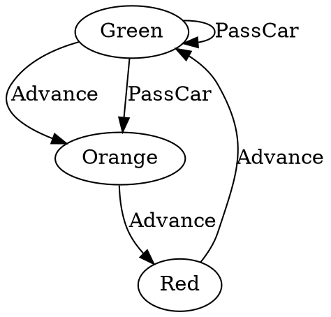

# Machine

[](https://gitter.im/Geal/nom?utm_source=badge&utm_medium=badge&utm_campaign=pr-badge&utm_content=badge)
[](https://travis-ci.org/Geal/machine)
[](https://coveralls.io/r/Geal/machine?branch=master)

## Features

This crate defines three procedural macros to help you write enum based state machines,
without writing the associated boilerplate.

* define a state machine as an enum, each variant can contain members
* an Error state for invalid transitions is added automatically
* transitions can have multiple end states if needed (conditions depending on message content, etc)
* accessors can be generated for state members
* wrapper methods and accessors are generated on the parent enum
* the generated code is also written in the `target/` directory for further inspection
* a dot file is written in the `target/` directory for graph generation

## Usage

machine is available on [crates.io](https://crates.io/crates/machine) and can be included in your Cargo enabled project like this:

```toml
[dependencies]
machine = "^0.2"
```

Then include it in your code like this:

```rust
#[macro_use]
extern crate machine;
```

## Example: the traffic light

We'll define a state machine representing a traffic light, specifying a maximum
number of cars passing while in the green state.

The following machine definition:

```rust
machine!(
  enum Traffic {
    Green { count: u8 },
    Orange,
    Red
  }
);
```

will produce the following code:

```rust
#[derive(Clone, Debug, PartialEq)]
pub enum Traffic {
    Error,
    Green(Green),
    Orange(Orange),
    Red(Red),
}

#[derive(Clone, Debug, PartialEq)]
pub struct Green {
    count: u8,
}

#[derive(Clone, Debug, PartialEq)]
pub struct Orange {}

#[derive(Clone, Debug, PartialEq)]
pub struct Red {}

impl Traffic {
  pub fn green(count: u8) -> Traffic {
    Traffic::Green(Green { count })
  }
  pub fn orange() -> Traffic {
    Traffic::Orange(Orange {})
  }
  pub fn red() -> Traffic {
    Traffic::Red(Red {})
  }
  pub fn error() -> Traffic {
    Traffic::Error
  }
}
```

### Transitions

From there, we can define the `Advance` message to go to the next color, and the associated
transitions:

```rust
#[derive(Clone,Debug,PartialEq)]
pub struct Advance;

transitions!(Traffic,
  [
    (Green, Advance) => Orange,
    (Orange, Advance) => Red,
    (Red, Advance) => Green
  ]
);
```

This will generate an enum holding the messages for that state machine,
and a `on_advance` method on the parent enum.

```rust
#[derive(Clone, Debug, PartialEq)]
pub enum TrafficMessages {
    Advance(Advance),
}

impl Traffic {
  pub fn on_advance(self, input: Advance) -> Traffic {
    match self {
      Traffic::Green(state) => Traffic::Orange(state.on_advance(input)),
      Traffic::Orange(state) => Traffic::Red(state.on_advance(input)),
      Traffic::Red(state) => Traffic::Green(state.on_advance(input)),
      _ => Traffic::Error,
    }
  }
}
```

The compiler will then complain that the `on_advance` is missing on the
`Green`, `Orange` and `Red` structures:

```
error[E0599]: no method named `on_advance` found for type `Green` in the current scope
  --> tests/t.rs:18:1
   |
4  | / machine!(
5  | |   enum Traffic {
6  | |     Green { count: u8 },
7  | |     Orange,
8  | |     Red,
9  | |   }
10 | | );
   | |__- method `on_advance` not found for this
...
18 | / transitions!(Traffic,
19 | |   [
20 | |     (Green, Advance) => Orange,
21 | |     (Orange, Advance) => Red,
22 | |     (Red, Advance) => Green
23 | |   ]
24 | | );
   | |__^

[...]
```

The `transitions` macro takes care of the boilerplate, writing the wrapper
methods, and making sure that a state machine receiving the wrong message
will get into the error state. But we still need to define manually the
transition functions for each of our states, since most of the work will
be done there:

```rust
impl Green {
  pub fn on_advance(self, _: Advance) -> Orange {
    Orange {}
  }
}

impl Orange {
  pub fn on_advance(self, _: Advance) -> Red {
    Red {}
  }
}

impl Red {
  pub fn on_advance(self, _: Advance) -> Green {
    Green {
      count: 0
    }
  }
}
```

Now we want to add a message to count passing cars when in the green state,
and switch to the orange state if at least 10 cars have passed.
So the `PassCar` message is only accepted by the green state, and the
transition has two possible end states, green and orange.
While we might want a clean state machine where each state and message
combination only has one end state, we could have conditions depending
on message values, or state members that would not require creating
new states or messages instead:

```rust
#[derive(Clone,Debug,PartialEq)]
pub struct PassCar { count: u8 }

transitions!(Traffic,
  [
    (Green, Advance) => Orange,
    (Orange, Advance) => Red,
    (Red, Advance) => Green,
    (Green, PassCar) => [Green, Orange]
  ]
);

impl Green {
  pub fn on_pass_car(self, input: PassCar) -> Traffic {
    let count = self.count + input.count;
    if count >= 10 {
      println!("reached max cars count: {}", count);
      Traffic::orange()
    } else {
      Traffic::green(count)
    }
  }
}
```

The `on_pass_car` method can have multiple end states, so it must
return a `Traffic`.

The generated code will now contain a `on_pass_car` for the
`Traffic` enum. Note that if a state other than `Green`
receives the `PassCar` message, the state machine will go
into the `Error` state and stay there indefinitely.

```rust
#[derive(Clone, Debug, PartialEq)]
pub enum TrafficMessages {
  Advance(Advance),
  PassCar(PassCar),
}

impl Traffic {
  pub fn on_advance(self, input: Advance) -> Traffic {
    match self {
      Traffic::Green(state) => Traffic::Orange(state.on_advance(input)),
      Traffic::Orange(state) => Traffic::Red(state.on_advance(input)),
      Traffic::Red(state) => Traffic::Green(state.on_advance(input)),
      _ => Traffic::Error,
    }
  }

  pub fn on_pass_car(self, input: PassCar) -> Traffic {
    match self {
      Traffic::Green(state) => state.on_pass_car(input),
      _ => Traffic::Error,
    }
  }
}
```

The complete generated code can be found in `target/traffic.rs`.

The machine crate will also generate the `target/traffic.dot` file
for graphviz usage:



`dot -Tpng target/traffic.dot > traffic.png` will generate the following image:


We can then use the messages to trigger transitions:

```rust
// starting in green state, no cars have passed
let mut t = Traffic::Green(Green { count: 0 });

t = t.on_pass_car(PassCar { count: 1});
t = t.on_pass_car(PassCar { count: 2});
// still in green state, 3 cars have passed
assert_eq!(t, Traffic::green(3));

// each advance call will move to the next color
t = t.on_advance(Advance);
assert_eq!(t, Traffic::orange());

t = t.on_advance(Advance);
assert_eq!(t, Traffic::red());

t = t.on_advance(Advance);
assert_eq!(t, Traffic::green(0));
t = t.on_pass_car(PassCar { count: 5 });
assert_eq!(t, Traffic::green(5));

// when more than 10 cars have passed, go to the orange state
t = t.on_pass_car(PassCar { count: 7 });
assert_eq!(t, Traffic::orange());
t = t.on_advance(Advance);
assert_eq!(t, Traffic::red());

// if we try to use the PassCar message on state other than Green,
// we go into the error state
t = t.on_pass_car(PassCar { count: 7 });
assert_eq!(t, Traffic::error());

// once in the error state, we stay in the error state
t = t.on_advance(Advance);
assert_eq!(t, Traffic::error());
```

### Methods

The `methods!` procedural macro can generate wrapper methods for state member
accessors, or require method implementations on states:

```rust
methods!(Traffic,
  [
    Green => get count: u8,
    Green => set count: u8,
    Green, Orange, Red => fn can_pass(&self) -> bool
  ]
);
```

This will generate:
- a `count()` getter for the `Green` state (`get`) and the wrapping enum
- a `count_mut()` setter for the `Green` state (`set`) and the wrapping enum
- a `can_pass()` method for the wrapping enum, requiring its implementations for all states

Methods can have arguments, and those will be passed to the corresponding method
on states, as expected.

```rust
impl Orange {}
impl Red {}
impl Green {
  pub fn count(&self) -> &u8 {
    &self.count
  }

  pub fn count_mut(&mut self) -> &mut u8 {
    &mut self.count
  }
}

impl Traffic {
  pub fn count(&self) -> Option<&u8> {
    match self {
      Traffic::Green(ref v) => Some(v.count()),
      _ => None,
    }
  }

  pub fn count_mut(&mut self) -> Option<&mut u8> {
    match self {
      Traffic::Green(ref mut v) => Some(v.count_mut()),
      _ => None,
    }
  }

  pub fn can_pass(&self) -> Option<bool> {
    match self {
      Traffic::Green(ref v) => Some(v.can_pass()),
      Traffic::Orange(ref v) => Some(v.can_pass()),
      Traffic::Red(ref v) => Some(v.can_pass()),
      _ => None,
    }
  }
}
```

We can now add the remaining methods and get a working state machine:

```rust
impl Green {
  pub fn can_pass(&self) -> bool {
    true
  }
}

impl Orange {
  pub fn can_pass(&self) -> bool {
    false
  }
}

impl Red {
  pub fn can_pass(&self) -> bool {
    false
  }
}
```

## License

Licensed under either of

 * Apache License, Version 2.0 ([LICENSE-APACHE](LICENSE-APACHE) or http://www.apache.org/licenses/LICENSE-2.0)
 * MIT license ([LICENSE-MIT](LICENSE-MIT) or http://opensource.org/licenses/MIT)

at your option.

### Contribution

Unless you explicitly state otherwise, any contribution intentionally submitted
for inclusion in the work by you, as defined in the Apache-2.0 license, shall be dual licensed as above, without any
additional terms or conditions.

